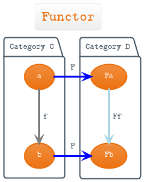
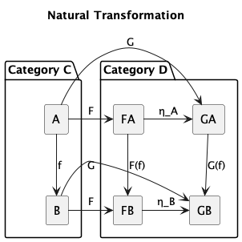
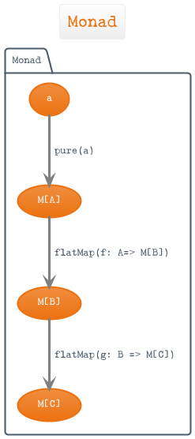
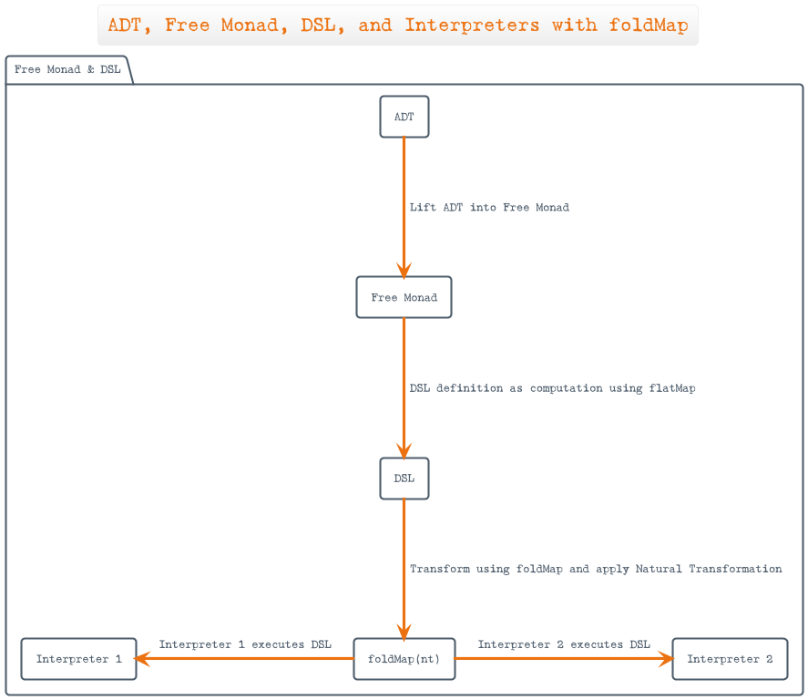
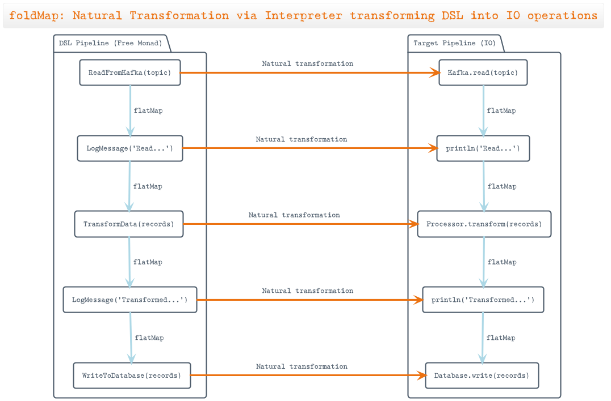

# Free Monads for Declarative Data Pipelines

## Resources
- [The Interpreter Pattern Revisited](https://www.youtube.com/watch?v=hmX2s3pe_qk&list=WL&index=10)
- [Categories for the Working Hacker](https://www.youtube.com/watch?v=gui_SE8rJUM)
- [Functional Data Engineering — a modern paradigm for batch data processing](https://maximebeauchemin.medium.com/functional-data-engineering-a-modern-paradigm-for-batch-data-processing-2327ec32c42a)
- [Functional Data Engineering - A Set of Best Practices](https://www.youtube.com/watch?v=4Spo2QRTz1k&list=WL&index=13&t=21s)
- [Free monads and event sourcing architecture](https://www.stephenzoio.com/free-monads-and-event-sourcing/)
- [Hexagonal Architecture and Free Monad: Two related design patterns?](https://deque.blog/2017/07/06/hexagonal-architecture-a-less-declarative-free-monad/)
