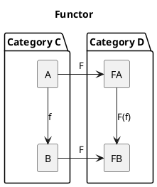

```plantuml
@startuml
title Functor

package "Category C" as C{
  rectangle A
  rectangle B
  A --> B : f
}

package "Category D" as D{
  rectangle FA
  rectangle FB
  FA --> FB : "F(f)"
}

' Functor F mappings
A -r--> FA : F
B -r--> FB : F
@enduml
```