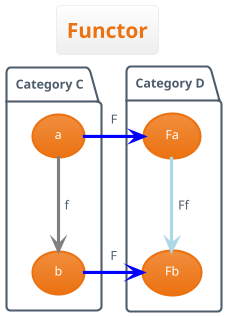

```plantuml
@startuml
!theme aws-orange
skinparam defaultFontName "Gabriele Black Ribbon FG"
title Functor

package "Category C" as C{
  (a)
  (b)
  a -[#gray]-> b : f
}

package "Category D" as D{
  (Fa)
  (Fb)
  Fa -[#lightblue]-> Fb : "Ff"
}

' Functor F mappings
a -r[#blue]-> Fa : F
b -r[#blue]-> Fb : F
@enduml
```