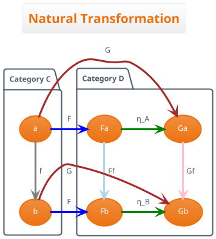

```plantuml
@startuml
!theme aws-orange
skinparam defaultFontName "Gabriele Black Ribbon FG"
title Natural Transformation

package "Category C" {
  (a)
  (b)
  a -[#gray]-> b : f
}

package "Category D" {
  (Fa)
  (Fb)
  (Ga)
  (Gb)
  Fa -[#lightblue]-> Fb : Ff
  Ga -[#pink]-> Gb : Gf
}

' Functor F mappings
a -r[#blue]-> Fa : F
b -r[#blue]-> Fb : F

' Functor G mappings
a -r[#brown]-> Ga : G
b -r[#brown]-> Gb : G

' Natural transformation
Fa -r[#green]-> Ga : η_A
Fb -r[#green]-> Gb : η_B

@enduml
```