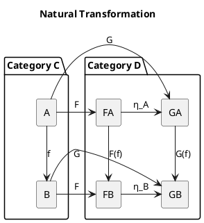

```plantuml
@startuml
title Natural Transformation

package "Category C" {
  rectangle A
  rectangle B
  A --> B : f
}

package "Category D" {
  rectangle FA
  rectangle FB
  rectangle GA
  rectangle GB
  FA --> FB : "F(f)"
  GA --> GB : "G(f)"
}

' Functor F mappings
A -r--> FA : F
B -r--> FB : F

' Functor G mappings
A -r--> GA : G
B -r--> GB : G

' Natural transformation
FA -r--> GA : η_A
FB -r--> GB : η_B

@enduml
```