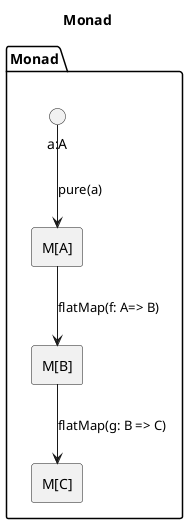

```plantuml
@startuml
title Monad

package "Monad" {
  circle "a:A" as a
  rectangle "M[A]" as pure
  rectangle "M[B]" as f
  rectangle "M[C]" as g
}

' Value lifted into monad
a --> pure : "pure(a)"

' Chaining operations with flatMap
pure --> f : "flatMap(f: A=> B)"
f --> g : "flatMap(g: B => C)"

@enduml
```