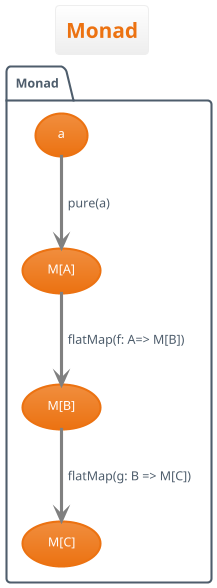

```plantuml
@startuml
!theme aws-orange
skinparam defaultFontName "Gabriele Black Ribbon FG"
title Monad

package "Monad" {
  (a)
  (M[A]) as pure
  (M[B]) as mb
  (M[C]) as mc
}

' Value lifted into monad
a -[#gray]-> pure : "pure(a)"

' Chaining operations with flatMap
pure -[#gray]-> mb : "flatMap(f: A=> M[B])"
mb -[#gray]-> mc : "flatMap(g: B => M[C])"

@enduml
```