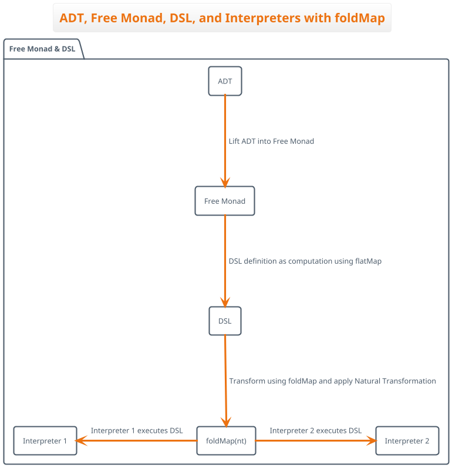

```plantuml
@startuml
!theme aws-orange
skinparam defaultFontName "Gabriele Black Ribbon FG"
title ADT, Free Monad, DSL, and Interpreters with foldMap

package "Free Monad & DSL" {
  rectangle "ADT" as ADT
  rectangle "Free Monad" as FreeMonad
  rectangle "DSL" as DSL
  rectangle "Interpreter 1" as Interpreter1
  rectangle "Interpreter 2" as Interpreter2
  rectangle "foldMap(nt)" as foldMap
}

ADT -d--> FreeMonad : "Lift ADT into Free Monad"

FreeMonad -d--> DSL : "DSL definition as computation using flatMap"


DSL -d--> foldMap : "Transform using foldMap and apply Natural Transformation"

' Interpreters interpret the transformed DSL
foldMap -l--> Interpreter1 : "Interpreter 1 executes DSL"
foldMap -r--> Interpreter2 : "Interpreter 2 executes DSL"

@enduml
```