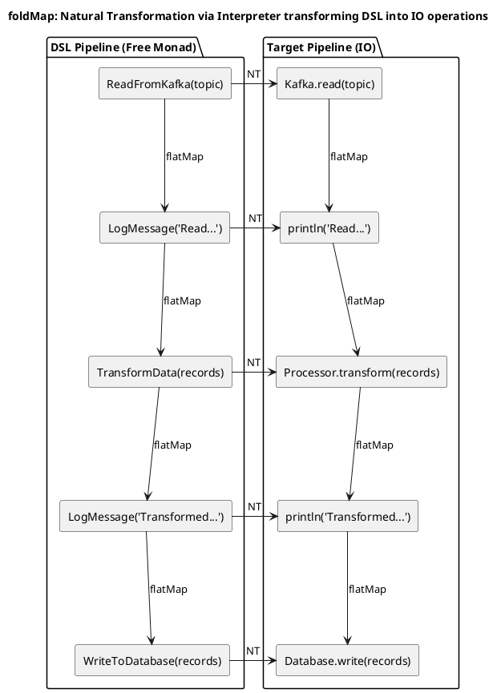

```plantuml
@startuml
title foldMap: Natural Transformation via Interpreter transforming DSL into IO operations

' DSL pipeline created by flatMap and liftF
package "DSL Pipeline (Free Monad)" as dsl {
  rectangle "ReadFromKafka(topic)" as readFromKafka
  rectangle "LogMessage('Read...')" as logMessage
  rectangle "TransformData(records)" as transformData
  rectangle "LogMessage('Transformed...')" as logMessage2
  rectangle "WriteToDatabase(records)" as writeToDatabase
}

' Target pipeline (IO)
package "Target Pipeline (IO)"  as io{
  rectangle "Kafka.read(topic)" as targetReadFromKafka
  rectangle "println('Read...')" as targetLogMessage
  rectangle "Processor.transform(records)" as targetTransformData
  rectangle "println('Transformed...')" as targetLogMessage2
  rectangle "Database.write(records)" as targetWriteToDatabase
}


' NT transforms DSL pipeline into Target pipeline via Interpreter
readFromKafka   -r->   targetReadFromKafka : "NT"
logMessage      -r->   targetLogMessage : "NT"
transformData   -r->   targetTransformData : "NT"
logMessage2     -r->   targetLogMessage2 : "NT"
writeToDatabase -r->   targetWriteToDatabase : "NT"

targetReadFromKafka -d--> targetLogMessage : "flatMap"
targetLogMessage -d--> targetTransformData : "flatMap"
targetTransformData -d--> targetLogMessage2 : "flatMap"
targetLogMessage2 -d--> targetWriteToDatabase : "flatMap"


' FlatMap chain in the DSL pipeline
readFromKafka -d--> logMessage : "flatMap"
logMessage -d--> transformData : "flatMap"
transformData -d--> logMessage2 : "flatMap"
logMessage2 -d--> writeToDatabase : "flatMap"

@enduml
```